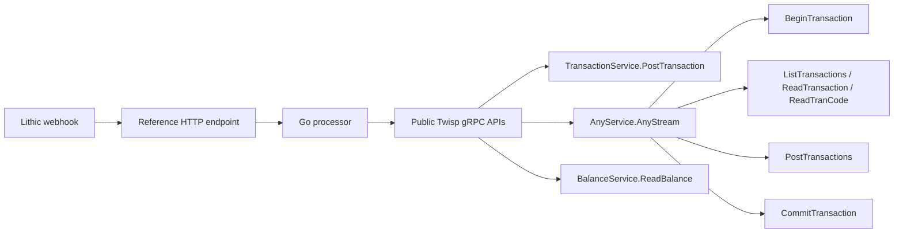
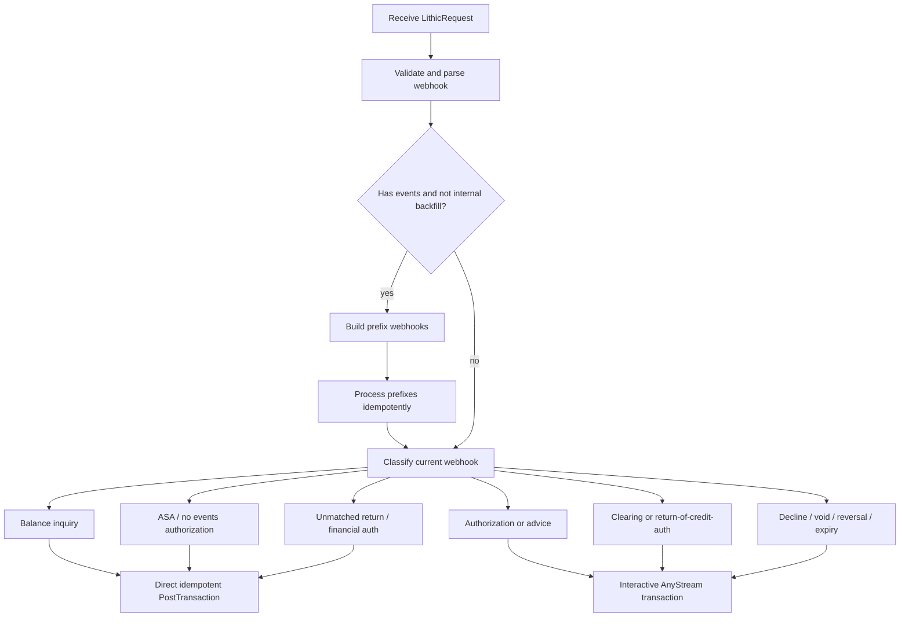
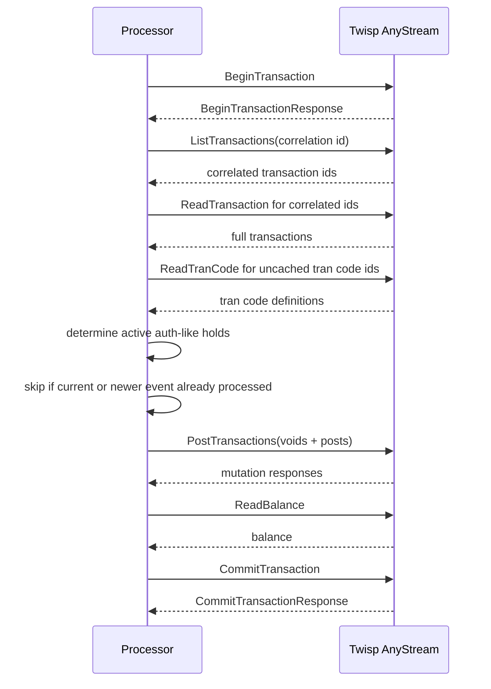
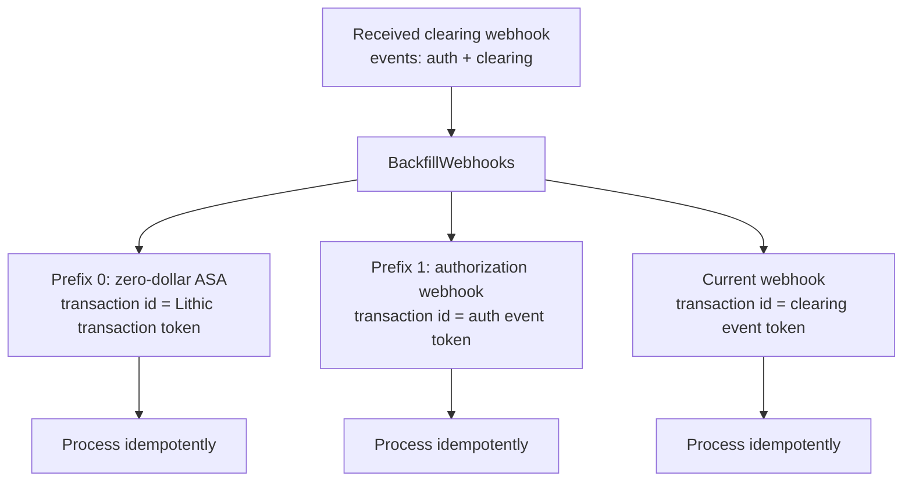
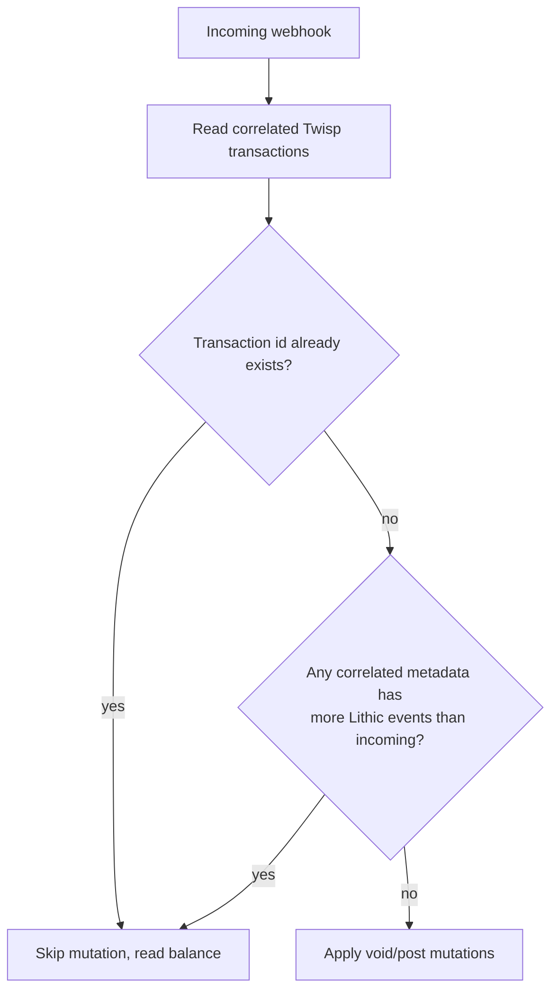

# Twisp Lithic Go Reference

This project is a reference implementation that demonstrates how a customer can process Lithic card webhooks with Twisp using only public Twisp gRPC APIs.

It is intentionally small and explicit. The goal is to show the accounting pattern, not to provide a complete production integration framework. The processor accepts Lithic webhook payloads, chooses built-in Twisp card tran codes, posts or voids Twisp transactions, and handles out-of-order webhook delivery with deterministic backfill and idempotency.

## What This Demonstrates

- A single HTTP endpoint for Lithic webhook processing.
- Public Twisp APIs only. The implementation does not call Twisp's private Lithic workflow service.
- Built-in Twisp card tran codes such as `SYS_CARD_HOLD`, `SYS_CARD_SETTLE`, `SYS_CARD_BALANCE_INQUIRY`, and `SYS_CARD_DECLINE`.
- Interactive Twisp transactions through `AnyService.AnyStream`.
- Batched mutations with `PostTransactions` inside `AnyRequest` when multiple transaction operations need to happen together.
- Idempotent replay behavior for normal delivery and out-of-order delivery.
- Velocity enforcement is left active for real ASA authorization requests and overridden to WARN for advice-style posts and backfill.
- Testcontainers coverage against a real local Twisp instance.

## Lithic Reading

These Lithic docs are useful context for the transaction shapes and delivery assumptions modeled by this reference implementation:

- [Transaction Flow](https://docs.lithic.com/docs/transaction-flow): normal authorization, advice, clearing, reversal, expiry, credit, and return sequences.
- [Auth Stream Access Request](https://docs.lithic.com/reference/post_card-authorization-approval-request): ASA request payload shape for decision-point authorization requests.
- [Transaction Object](https://docs.lithic.com/docs/transactions): transaction status, amount, event, and token semantics.
- [Get Card Transaction](https://docs.lithic.com/reference/gettransactionbytoken): Lithic API for reading the current transaction state by transaction token.
- [Events API and Webhooks](https://docs.lithic.com/docs/events-api): event delivery model for webhook subscriptions.
- [Migrate from Legacy Transaction Webhooks to our Events API](https://docs.lithic.com/docs/migrate-from-legacy-transaction-webhooks-to-our-events-api): migration guidance, including the recommendation that webhook processors be idempotent because delivery is at least once.
- [Idempotent Requests](https://docs.lithic.com/docs/idempotent-requests): Lithic's API-level idempotency model.
- [Lithic docs index for agents](https://docs.lithic.com/llms.txt): Markdown/OpenAPI index for finding the current human-readable docs.

## Request Shape

The HTTP endpoint accepts a `LithicRequest`.

```json
{
  "accountId": "cardholder-account-uuid",
  "journalId": "journal-uuid",
  "settlementAccountId": "settlement-account-uuid",
  "webhook": {
    "token": "lithic-transaction-token",
    "status": "AUTHORIZATION",
    "authorization_amount": 1000,
    "created": "2026-06-09T10:00:00Z",
    "events": []
  }
}
```

The top-level `webhook.token` is treated as the Lithic transaction correlation id. If the webhook has events, the current accounting event id is the last event token. If it has no events, the accounting event id is the top-level token.

## Architecture



The processor uses direct unary calls for simple one-post flows. It uses `AnyStream` for flows that need to read current transaction state and then perform mutations based on that state.

## Processing Model

Each incoming webhook follows this high-level flow:



Simple flows post one Twisp transaction and then read the resulting balance.

Stateful flows use an interactive transaction so the read phase and mutation phase see a consistent Twisp state.

## Interactive Transaction Flow

Authorization replacement, clearing, and void-like flows use `AnyStream`.



If anything fails before commit, the processor attempts `RollbackTransaction` on the same stream.

## Tran Code Mapping

The reference implementation uses built-in Twisp card tran codes.

| Lithic condition | Twisp behavior |
| --- | --- |
| Balance inquiry | post `SYS_CARD_BALANCE_INQUIRY` |
| ASA or initial authorization with no events | post `SYS_CARD_HOLD` |
| Authorization / authorization advice | void active auth holds, post replacement `SYS_CARD_HOLD` |
| Clearing | void active auth holds, post `SYS_CARD_SETTLE`, optionally post remaining `SYS_CARD_HOLD` |
| Return of credit authorization | clear and replace like clearing |
| Unmatched return | post `SYS_CARD_SETTLE` |
| Financial authorization | post `SYS_CARD_SETTLE` |
| Credit authorization | void active auth holds, post replacement `SYS_CARD_HOLD` in credit direction |
| Decline / void / authorization reversal / authorization expiry | void active auth holds and post a zero-impact `SYS_CARD_DECLINE` marker |

The zero-impact marker is important for out-of-order delivery. It records that a terminal event has been processed without changing the final balance. Later stale authorization snapshots can then be recognized and skipped.

Real ASA authorization posts do not override Twisp velocity enforcement. Those are the decision-point requests where velocity controls should be able to decline a card transaction. Backfill posts and non-ASA posts set `OverrideVelocityEnforcement` to WARN because they represent advice or reconciliation messages that should be recorded after Lithic has already reached a transaction state.

## Backfill And Out-Of-Order Delivery

Lithic transaction webhooks carry the event history for the transaction. If a later webhook arrives before earlier webhook deliveries, the processor can synthesize the missing earlier prefixes from that one payload.

For example, a clearing payload with two events:

```json
[
  {"type": "AUTHORIZATION", "token": "auth-event-id"},
  {"type": "CLEARING", "token": "clearing-event-id"}
]
```

produces these internal processing steps:



The transaction IDs are chosen to match the real webhook deliveries:

- No-event ASA: `transaction_id = webhook.token`
- Event webhook: `transaction_id = last_event.token`

That means if the real `PENDING` authorization webhook arrives later, it uses the same `auth event token` and is recognized as already processed.

## Idempotency Model

Twisp `PostTransaction`, `PostTransactions`, and `VoidTransaction` requests are marked idempotent. That handles exact duplicate requests.

Out-of-order webhooks need one additional rule: stale earlier snapshots must be skipped when a later snapshot for the same Lithic transaction has already been processed.

The processor uses correlated Twisp transactions and webhook metadata to make that decision:



Every post stores the raw Lithic webhook as Twisp transaction metadata. Void operations also carry the webhook metadata. This gives the processor enough information to tell whether a later event has already won.

## Why Backfill Uses Zero-Dollar ASA

When a later webhook is the first payload received, it is not always possible to reconstruct the original no-event ASA amount exactly from the later snapshot. The Twisp workflow implementation uses a zero-dollar synthetic ASA for this same reason.

The zero-dollar ASA is still useful because it claims the top-level Lithic transaction token. If the real ASA arrives later with a non-zero amount, the processor sees that the token is already represented and skips it instead of creating stale pending balance.

## Consistency Guarantees

This reference implementation aims for these properties:

- Ordered webhook delivery converges to the expected balance.
- Replayed webhook delivery is idempotent.
- Later webhook snapshots can backfill missing earlier prefixes.
- Stale earlier snapshots delivered after later snapshots do not recreate holds.
- Read/update transaction flows happen inside Twisp interactive transactions.

This implementation does not attempt to model every operational concern a production integration may need, such as persistent retry queues, request authentication, alerting, observability, or long-term replay tooling.

## Running Locally

Run the HTTP service against a local Twisp server:

```sh
TWISP_GRPC_TARGET=localhost:8081 TWISP_ACCOUNT_ID=000000000000 go run ./cmd/server
```

Run unit tests:

```sh
GOWORK=off go test ./...
```

Run the real Twisp Testcontainers integration test after loading or publishing a local Twisp image:

```sh
GOWORK=off TWISP_TESTCONTAINERS=1 TWISP_LOCAL_IMAGE=public.ecr.aws/twisp/local:latest go test ./... -run TestWebhookFixtureAgainstTwispContainer -count=1
```

Run the ordered and permutation fixture tests against real Twisp:

```sh
GOWORK=off TWISP_TESTCONTAINERS=1 TWISP_LOCAL_IMAGE=public.ecr.aws/twisp/local:latest go test ./... -run 'TestWebhookFixture(AgainstTwispContainer|PermutationsAgainstTwispContainer)' -count=1
```

## Test Coverage

The integration tests use the Lithic webhook fixtures from Twisp's Lithic workflow tests.

- `TestWebhookFixtureAgainstTwispContainer` validates ordered delivery against real Twisp.
- `TestWebhookFixturePermutationsAgainstTwispContainer` validates out-of-order delivery. It runs all permutations for short fixture sequences and deterministic high-signal orders for longer sequences, including reverse and last-first delivery.
